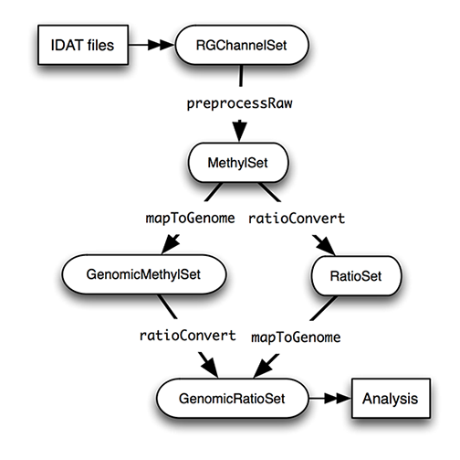

```{r setup, include=FALSE}
knitr::opts_chunk$set(echo = TRUE)
```  

-----

## Getting Started

This tutorial presents a workflow for analysing Illumina 450K methylation data using R. In this part we consider the R package [minfi](https://www.bioconductor.org/packages/release/bioc/html/minfi.html). 

We start by reading in DNA methylation data from an example dataset and end with a complete analysis. The initial data may be read as an '.idat' file (a raw format proprietary to the Illumina 450K platform) or from a tab-delimited file provided by [The Cancer Genome Atlas](https://cancergenome.nih.gov/). Minfi also provides a way to read unmethylated/methylated data directly from the Gene Expression Omnibus
[GEO](https://www.ncbi.nlm.nih.gov/geo/info/faq.html). Each of these methods will be considered.

The Illumina 450k platform provides a cost-effective means to assess and quantify methylation levels. While the analysis is 'genome-wide' it is important to recognize that the Illumina platform measures methylation at ~450,000 CpG loci where many sites are associated specifically around a gene promoter. The 450K platform provides quantitative methylation information at the single CpG site level. 

Minfi is one of many R packages capable of analysing methylation data (an exhaustive list is [here](https://www.bioconductor.org/packages/release/BiocViews.html#___DNAMethylation)) however it is among the most comprehensive available. 

The data required for this workflow has been bundled in an R package **minfiData**. At any time if you want more specific help on a topic:

```{r eval=FALSE}
help(minfi)
help(minfiData)
```

We will also provide examples of how to quality-control and visualize methylation data using a tool called  [shinyMethyl](https://www.bioconductor.org/packages/release/bioc/html/shinyMethyl.html).

-----

### Background

The end goal of methylation studies is often to build a list of candidate genes for differential methylation analysis. To accomplish this genome-wide DNA methylation profiling is performed across a range of CpG sites in order to identify either hypo- or hyper-methylated gene loci. 

Hypermethylation at gene promoters is associated with transcriptional silencing and one of the best-known attributes of malignancy is repression of tumor-suppressor genes by hyper-methylation at promoter CpG islands. Thus, while deriving a list of candidate genes is important, for purposes of this tutorial understanding how to detect and identify Differentially Methylated Regions (**DMRs**) is the primary goal. 

Several variables are measured when analyzing methylation levels (M=methylated, U=unmethylated) at single loci or in terms of CpG structures across the genome.  

- **Beta Values:**

$$\beta = \frac{M}{M+U+100}$$

- **M Values:**
$$M = \log(\frac{M}{U})$$

- **DMPs:** A single genomic position with a different methylation level in two different sample groups (e.g. cancer/normal).

- **DMRs:** Consecutive genomic locations differentially methylated in the same direction. DMRs are genomic regions that show different DNA methylation status across different  samples. These may be regarded as possible functional regions involved in gene transcriptional regulation. 

The last two structures are statistical entities. In order to conduct methylation analysis several pre-processing steps are taken (in order) with the goal of assuring the validity of these statistical entities: 

  - Quality Control
  - Filtering and Normalization 
  - Statistical testing for probe-wise differential methylation
    - analysis of differentially methylated positions **(DMPs)**
    - 'bump hunting' for Differentially Methylated Regions **(DMRs)**
    
------

### Setting Up

##### We use BiocManager to install Bioconductor packages for R version > 3.5
```{r message=FALSE, cache=TRUE}
if (!requireNamespace("BiocManager"))
  install.packages("BiocManager") 
```
##### To install packages using BiocManager:
```{r eval=FALSE}
BiocManager::install(c("minfi"))
```
##### You may have to run the same command as above to install the rest of the packages. The following are specific to the first two parts of this tutorial.
```{r message=FALSE}
library(limma)
library(minfi)
library(minfiData)
library(sva)
library(Gviz)
library(shinyMethyl)
library(shinyMethylData)
```
Additional sections require these packages as well but they can be skipped for now.
```{r message=FALSE}
library(FlowSorted.Blood.450k)
library(IlluminaHumanMethylation450kanno.ilmn12.hg19)
library(IlluminaHumanMethylation450kmanifest)
library(RColorBrewer)
```
-----

### minfi Class Structure

**minfi** contains a number of classes that correspond to the raw data transformations. Understanding how these relate to one another is important.



-----

### Reading Raw Data from Illumina

A starting point for analysis is to read in raw .IDAT files (produced by Illumina) with the built-in function **read.metharray.sheet**. Using this method one reads in a sample sheet and uses it to reference/load data into an **RGChannelSet** object. 

```{r message=FALSE}
baseDir <- system.file("extdata", package="minfiData")
targets <- read.metharray.sheet(baseDir)
```

The sample sheet is a CSV (comma-separated) file containing one line per sample with columns describing phenotypic data and other information. With this information in memory we can now load the data:

```{r message=FALSE}
RGSet <- read.metharray.exp(targets = targets)
```

The variable RGSet is a **RGChannelSet** object. Since we read the data from a data sheet experiment, the phenotype is also stored in the RGChannelSet. Phenotypic data may be accessed using the command **pData**:

```{r message=FALSE}
phenoData <- pData(RGSet)
phenoData[,1:6]
```
RGChannelSet stores a manifest that contains all probe design information:
```{r message=FALSE}
getManifest(RGSet)
```


#### MethylSet and RatioSet

A **MethylSet** object contains methylated and unmethylated signals.  The easiest way to construct a MethylSet is by using the function **preprocessRaw** which uses the array design to match up the different probes and color channels to construct the methylated and unmethylated signals.  This function does no normalization (that's coming later).

```{r message=FALSE}
MSet <- preprocessRaw(RGSet) 
MSet
```

Accessors methods **getMeth** and **getUnmeth** are used to get the methylated and unmethylated intensities:

```{r message=FALSE}
head(getMeth(MSet)[,1:3])
head(getUnmeth(MSet)[,1:3])
```

The **RatioSet** object is a class that stores Beta and/or M values instead of methylated and unmethylated signals. An optional copy number matrix **CN** forms the sum of methylated and unmethylated signals and may be also stored. A **RatioSet** is created using the function **ratioConvert**:

```{r message=FALSE}
ratioSet <- ratioConvert(MSet, what = "both", keepCN = TRUE)
ratioSet
```

------

### Reading Processed Data from The Cancer Genome Atlas (TCGA)

In addition to loading raw data from the Illumina platform, minfi allows reading pre-processed methylation data from The Cancer Genome Atlas. TCGA provides over 20,000 primary cancer and matched normal samples spanning 33 cancer types. Access to the TCGA genomic datasets is provided through the [Genomic Data Commons](https://gdc.cancer.gov/). To access methylation data from TCGA use the function **readTCGA**.  

```{r message=FALSE}
jhu_filename <- '../data/johnshopkins-data/jhu-TCGA-test.txt'
grset_from_TCGA <- readTCGA(jhu_filename)
grset_from_TCGA
```

To access the full annotation, use the command **getAnnotation**:

```{r message=FALSE}
annotation <- getAnnotation(grset_from_TCGA)
names(annotation)
```

The annotation above (ilmn12.hg19) is based on the R package **IlluminaHumanMethylation450kanno.ilmn12.hg19**.
There are a number of convenience functions to get parts of the annotation such as the following:

```{r message=FALSE}
TCGA_islands <- getIslandStatus(grset_from_TCGA)
head(TCGA_islands)
```

Note that the **readTCGA** method returns a GenomicRatioSet object. When processing methylation data from .idat files the function **mapToGenome** is used instead but it produces the same object class. The difference in loading from TCGA or from a raw .idat file is in the method applied to do basic quality control.

-----

### Mapping to the Genome

The function **mapToGenome** applied to a **RatioSet** adds genomic coordinates to each probe together with additional information. As is the case for the previous readTCGA method the output of mapToGenome is a **GenomicRatioSet** object. This class holds M or/and Beta values along with associated genomic coordinates. Both functions will silently drop any loci which cannot be mapped to a known genomic position, based on the associated annotation package. In other words, depending on annotation not all methylation loci will have a corresponding genomic position. 

```{r message=FALSE}
grset_from_IDAT <- mapToGenome(ratioSet)
grset_from_IDAT
```

**GenomicRatioSet** extends the class **SummarizedExperiment**. A SummarizedExperiment is a container of one or more assays. 

Two main accessors functions allow access to data from a **GenomicRatioSet**:

```{r message=FALSE}
beta <- getBeta(grset_from_IDAT)
m <- getM(grset_from_IDAT)
cn <- getCN(grset_from_IDAT)
```

```{r message=FALSE}
sampleNames <- sampleNames(grset_from_IDAT)
probeNames <- featureNames(grset_from_IDAT)
pheno <- pData(grset_from_IDAT)
```

We get the same result (and object class) whether we load our initial from an .idat file or from TCGA:
```{r message=FALSE}
IDAT_islands <- getIslandStatus(grset_from_IDAT)
head(IDAT_islands)
```
------

### Basic Quality Control

Reliable quality control is key to creating a reproducible analysis. If reading methylation data direct from raw .idat files the recommended method is to begin with a simple QC plot (described below). For QC of large-scale methylation datasets, such as those available through The Cancer Genome Atlas, the preferred way is to use [shinyMethyl](https://www.bioconductor.org/packages/release/bioc/html/shinyMethyl.html).

**minfi** provides simple QC using the log median intensity of both methylated (M) and unmethylated (U) channels. When plotting these two medians against one another good samples will tnd to cluster together while failed ones will separate and have lower overall median intensity. The line separating "bad" from "good" represents a useful cutoff which may need to be adapted to each specific dataset.  The functions **getQC** and **plotQC** are designed to extract and plot quality control information from a **MethylSet**:

```{r message=FALSE}
qc <- getQC(MSet)
head(qc)
plotQC(qc)
```

In the above case we have six acceptable samples (above the stippled line) and may proceed with the analysis.

This is the end of **Section One**. Go to [Section Two](./Tutorial-2.html).

-----